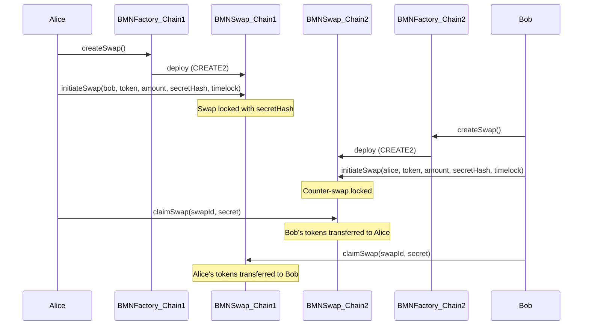
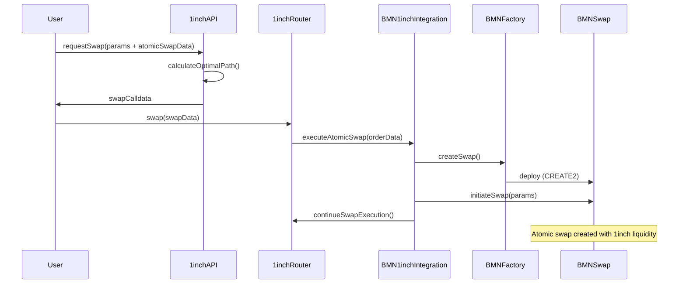
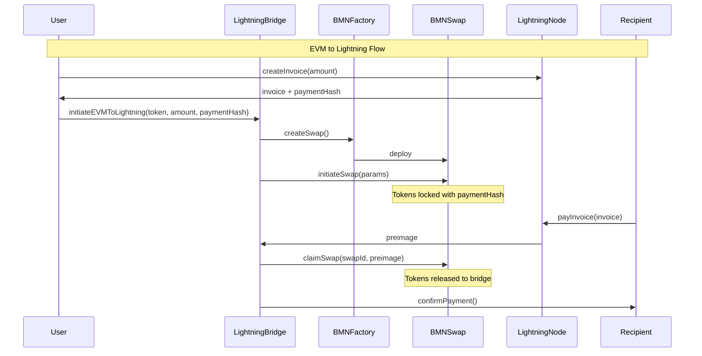

# Bridge Me Not V2 - Architecture Overview

## System Design Overview

Bridge Me Not V2 implements a modular, gas-efficient architecture for trustless cross-chain atomic swaps. The system eliminates traditional bridge risks by using Hash Time-Locked Contracts (HTLCs) while pioneering integration with the Lightning Network.

## Core Architecture Principles

### 1. **Trustless Security**
- No centralized bridge operators
- No wrapped token risk
- Cryptographic guarantees via HTLCs
- Time-based automatic refunds

### 2. **Modular Design**
- Separation of swap logic, routing, and integration layers
- Pluggable DEX aggregator support
- Chain-agnostic implementation
- Extensible for future protocols

### 3. **Gas Efficiency**
- Optimized storage layout
- Minimal external calls
- Batch operation support
- Deterministic addressing

## Contract Interaction Diagrams

### Basic Atomic Swap Flow



### 1inch Integration Flow



### Lightning Network Bridge Flow



## Data Flow Architecture

### Atomic Swap Data Flow

```
┌─────────────────────────────────────────────────────────────┐
│                      Initiation Phase                        │
├─────────────────────────────────────────────────────────────┤
│ 1. User generates secret and computes secretHash            │
│ 2. User calls factory.createSwap() → deterministic address  │
│ 3. User initiates swap with parameters                      │
│ 4. Tokens locked in contract                                │
│ 5. SwapInitiated event emitted                             │
└─────────────────────────────────────────────────────────────┘
                              │
                              ▼
┌─────────────────────────────────────────────────────────────┐
│                    Cross-Chain Coordination                  │
├─────────────────────────────────────────────────────────────┤
│ 1. Event picked up by indexers/relayers                     │
│ 2. Counterparty verifies swap parameters                    │
│ 3. Counterparty creates matching swap on destination chain  │
│ 4. Both swaps now active with same secretHash              │
└─────────────────────────────────────────────────────────────┘
                              │
                              ▼
┌─────────────────────────────────────────────────────────────┐
│                      Execution Phase                         │
├─────────────────────────────────────────────────────────────┤
│ 1. Initiator reveals secret on destination chain            │
│ 2. Claim transaction validates secret against hash          │
│ 3. Tokens transferred to initiator                          │
│ 4. Secret now public on blockchain                          │
│ 5. Counterparty uses secret to claim on source chain       │
└─────────────────────────────────────────────────────────────┘
```

### 1inch Integration Data Flow

```
┌────────────────┐     ┌─────────────────┐     ┌────────────────┐
│   User Input   │────▶│  1inch API Call │────▶│ Swap Calldata  │
└────────────────┘     └─────────────────┘     └────────────────┘
        │                                               │
        │                                               ▼
        │                                      ┌────────────────┐
        │                                      │ Execute Swap   │
        │                                      │ via Router     │
        │                                      └────────────────┘
        │                                               │
        ▼                                               ▼
┌────────────────┐                            ┌────────────────┐
│ Atomic Swap    │◀───────────────────────────│ BMN Extension  │
│ Parameters     │                            │ Triggered      │
└────────────────┘                            └────────────────┘
```

## Component Architecture

### 1. **BMNAtomicSwap Contract**

```solidity
contract BMNAtomicSwap {
    struct Swap {
        address initiator;
        address participant;
        address token;
        uint256 amount;
        bytes32 secretHash;
        uint256 timelock;
        bool withdrawn;
        bool refunded;
    }
    
    // Core functions
    function initiateSwap(...) external
    function claimSwap(uint256 swapId, bytes32 secret) external
    function refund(uint256 swapId) external
}
```

**Key Features:**
- Minimal storage footprint
- Gas-optimized struct packing
- Support for ETH and ERC20
- Emergency pause capability

### 2. **BMNAtomicSwapFactory**

```solidity
contract BMNAtomicSwapFactory {
    // CREATE2 deployment for deterministic addresses
    function createSwap(bytes32 salt) external returns (address)
    
    // Registry functions
    function getSwapAddress(bytes32 salt) external view returns (address)
    function isValidSwap(address swap) external view returns (bool)
}
```

**Key Features:**
- Deterministic addressing across chains
- Minimal deployment cost
- Registry for swap tracking
- Event emission for indexing

### 3. **BMN1inchIntegration**

```solidity
contract BMN1inchIntegration {
    // 1inch order extension handler
    function handleOrder(Order calldata order, bytes calldata extension) external
    
    // Atomic swap creation through 1inch
    function executeAtomicSwap(SwapDescription calldata desc) external
}
```

**Key Features:**
- Seamless 1inch V6 integration
- Order extension support
- Slippage protection
- Gas-efficient execution

### 4. **LightningBridge**

```solidity
contract LightningBridge {
    // EVM to Lightning
    function initiateEVMToLightning(
        address token,
        uint256 amount,
        bytes32 paymentHash,
        uint256 timelock
    ) external
    
    // Lightning to EVM
    function completeLightningToEVM(
        bytes32 paymentHash,
        bytes32 preimage
    ) external
}
```

**Key Features:**
- HTLC compatibility with Lightning
- Payment hash synchronization
- Automatic timeout handling
- Multi-token support

## Security Architecture

### Access Control Hierarchy

```
┌─────────────────────────────────────┐
│         DEFAULT_ADMIN_ROLE          │
│   (Deployment address initially)     │
└─────────────────────────────────────┘
                    │
        ┌───────────┴───────────┐
        │                       │
┌───────▼────────┐      ┌──────▼──────┐
│  PAUSER_ROLE   │      │ ADMIN_ROLE  │
│ (Emergency ops) │      │ (Settings)  │
└────────────────┘      └─────────────┘
```

### Security Layers

1. **Contract Level**
   - Reentrancy guards
   - Integer overflow protection
   - Access control modifiers
   - Emergency pause mechanism

2. **Protocol Level**
   - Time-based refunds
   - Cryptographic hash verification
   - Atomic execution guarantees
   - No admin key risks

3. **Integration Level**
   - Slippage protection
   - Deadline enforcement
   - Approved token lists
   - Rate limiting

## Scalability Considerations

### Horizontal Scaling
- Independent swap contracts
- Parallel execution support
- No global state dependencies
- Chain-agnostic design

### Vertical Scaling
- Batch swap creation
- Optimized storage usage
- Minimal computation overhead
- Efficient event emission

### Cross-Chain Scaling
- Deterministic addressing
- Standardized interfaces
- Universal HTLC format
- Lightning Network for instant settlement

## Future Architecture Extensions

### Planned Enhancements

1. **Advanced Routing**
   - Multi-hop atomic swaps
   - Liquidity aggregation
   - Dynamic path finding
   - MEV protection

2. **Additional Integrations**
   - Uniswap V4 hooks
   - CoW Protocol orders
   - 0x Protocol RFQ
   - Paraswap aggregation

3. **Enhanced Security**
   - Multi-signature controls
   - Time-delay mechanisms
   - Decentralized governance
   - Insurance fund

4. **Performance Optimizations**
   - L2 batch submissions
   - Merkle tree proofs
   - State channel integration
   - Zero-knowledge proofs

## Deployment Architecture

### Multi-Chain Deployment Strategy

```
┌─────────────────┐
│   Ethereum      │
│   Mainnet       │
│ (Primary Deploy)│
└────────┬────────┘
         │
    ┌────┴────┐
    │         │
┌───▼───┐ ┌──▼────┐ ┌────────┐ ┌─────────┐
│Arbitrum│ │Optimism│ │Polygon │ │  Base   │
│  One   │ │Mainnet │ │ PoS    │ │Mainnet  │
└────────┘ └────────┘ └────────┘ └─────────┘
```

### Infrastructure Requirements

1. **RPC Endpoints**
   - Primary and backup nodes
   - WebSocket connections
   - Archive node access
   - Rate limit handling

2. **Monitoring Stack**
   - Event indexers
   - Transaction monitors
   - Gas price oracles
   - Alert systems

3. **Relayer Network**
   - Cross-chain message passing
   - Transaction submission
   - Gas management
   - Failover handling

## Conclusion

Bridge Me Not V2's architecture prioritizes security, efficiency, and extensibility. By leveraging atomic swaps and pioneering Lightning Network integration, we provide a trustless alternative to traditional bridges while maintaining compatibility with existing DeFi infrastructure. The modular design ensures the protocol can evolve with the ecosystem while maintaining its core security guarantees.